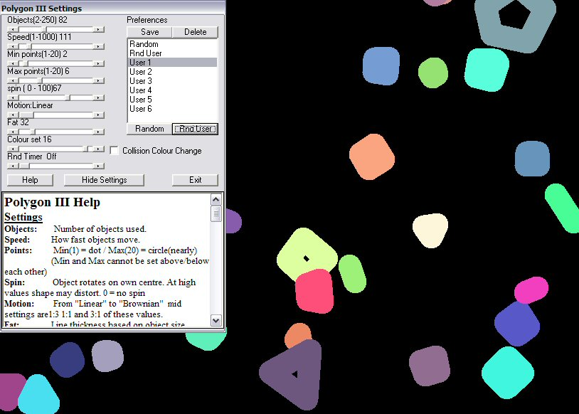



## Polygon Screen Saver IV

### Description

Added a few new properties and tightened up the code.

Inspired by 'Bouncing Polygon screensaver' by Brian Adriance at txtCodeId=52063.

Converted to allow more variety of shapes. Collision detection and all basic ideas are thanks to Brian Adriance. I rebuilt some of his routines to allow faster or more various values to be used easily. Sub DrawPoly is mine designed to allow a random number of points to be drawn. The polygons change shape in an orderly way cycling for min to max points then reversing direction. While you can use it as a screen saver (with random setting of number, speed, points and fatness) you can also experiment with the appearance by Left-clicking on the screen to show a form which allows you to play with the settings or by Right-clicking you can randomize the settings again. To stop the screensaver hold down a mouse button and drag it or press any key. NOTE Small bug causes initial bad redraws when timer fires but the clear up on next collision.
 
### More Info
 

             |
---                |---
**Submitted On**   |2004-03-07 20:45:08
**By**             |[Roger Gilchrist](https://github.com/Planet-Source-Code/PSCIndex/blob/master/ByAuthor/roger-gilchrist.md)
**Level**          |Intermediate
**User Rating**    |5.0 (10 globes from 2 users)
**Compatibility**  |VB 6\.0
**Category**       |[Graphics](https://github.com/Planet-Source-Code/PSCIndex/blob/master/ByCategory/graphics__1-46.md)
**World**          |[Visual Basic](https://github.com/Planet-Source-Code/PSCIndex/blob/master/ByWorld/visual-basic.md)
**Archive File**   |[Polygon\_Sc171729372004\.zip](https://github.com/Planet-Source-Code/roger-gilchrist-polygon-screen-saver-iv__1-52207/archive/master.zip)

